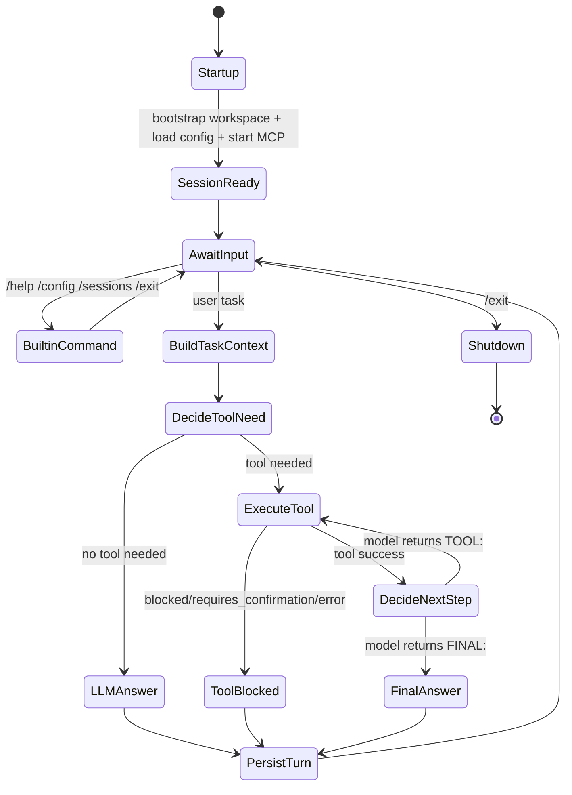

# 08 - State Diagram

## Goal
Provide a concrete state-machine view of `trace` runtime flow for planning and grading artifacts.

## Notes
- The autonomous loop is bounded by a max-step limit to avoid unbounded execution.
- Non-read shell commands remain governed by safety confirmation policies.
