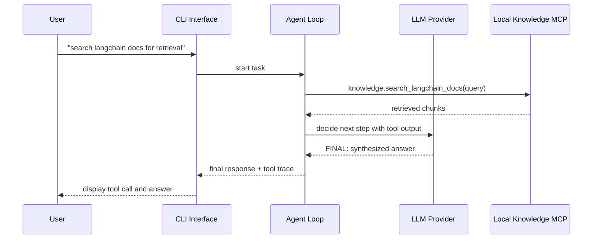
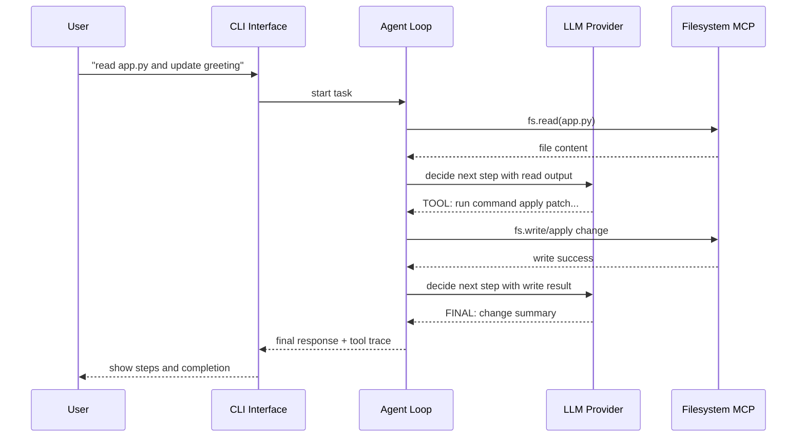
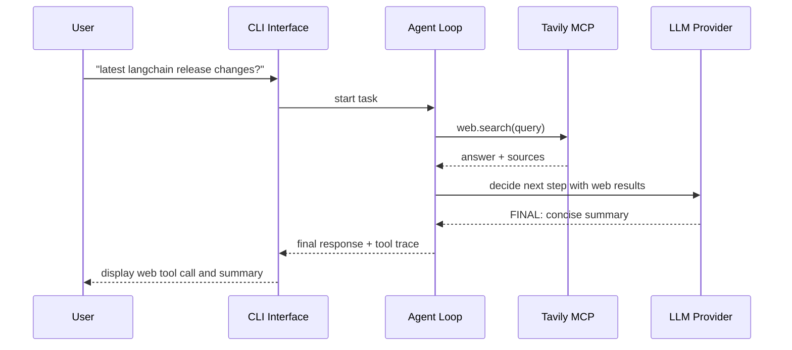

# 09 - Sequence Diagrams

## Scenario A: Documentation Question with Local RAG MCP

## Scenario B: Read File then Edit via Iterative Tool Calls

## Scenario C: Recency Query with External Web MCP

